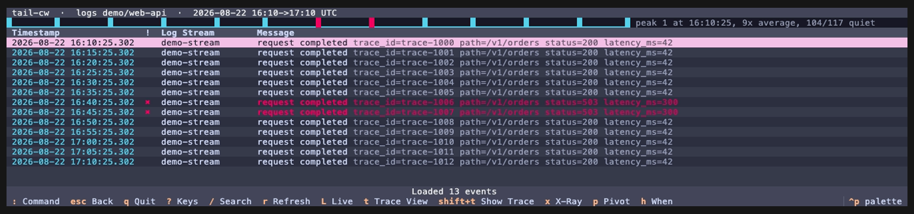
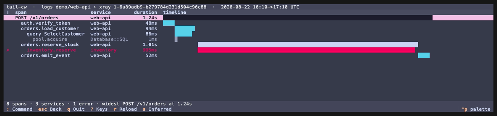

# tail-cw

Read and explore AWS CloudWatch from the terminal: tail logs live, open a dashboard you
already built in the console, reshape a metric chart with the keyboard, and drop from
any chart into the logs behind it.

The CloudWatch console answers "how is the service doing right now", but it pulls you
out of the terminal, and every dedicated CloudWatch tailer (awslogs, saw, cw, utern)
went dormant between 2019 and 2023 and predates the Live Tail API.
tail-cw stays where the work happens. It wraps `StartLiveTail` for real streaming,
caches every fetch as local Parquet so re-filtering costs nothing, and renders your
console dashboards as native terminal charts (Unicode, no graphics protocol, so they
work over SSH).
If what you want is a full web GUI, Grafana's CloudWatch data source is the honest
answer.
tail-cw aims to be the best terminal tool for a narrow set of daily tasks.

Run `tail-cw` with no arguments and you land in the log group browser.
Everything else is a keystroke away in the same app: `:` switches views, `Esc` goes up,
`Ctrl+O` and `Ctrl+I` walk a jumplist so diving into logs and coming back costs nothing.
One Textual-free core (`tail_cw/cli.py`) owns argument parsing, the cache, and the AWS
pipelines; the TUI and `tail-cw export` sit on top of the same functions, so agents and
humans drive one code path.
See the [ADRs](docs/docs/adr) for the decisions,
[the filter guide](docs/docs/FILTER_GUIDE.md) for the query syntax,
[plans/roadmap-2026-07.md](plans/roadmap-2026-07.md) for what is built and what is next,
and [AGENTS.md](AGENTS.md) for where to start.

## What it does

- A log group browser as the home screen, with a preview pane that shows each group's
    distinct message shapes and their counts, so you can tell forty `/aws/lambda/*` groups
    apart by content rather than by name.
    Groups you have opened before sort to the top, per account
- Named presets in config, so `tail-cw tail @api` opens the set of groups you always look
    at together
- Live tail through `StartLiveTail` (up to 10 groups) with a ring buffer, pause and
    resume, and bounded reconnect.
    `L` flips a historical search to live and back without losing the filter or window
- One filter model that reads the same across the live stream, a historical fetch, and
    cached data
- Every fetch cached as ZSTD Parquet and queried locally with DuckDB or Polars, so
    re-filtering and trace grouping are free after the first pull
- `tail-cw export alarms` lists metric alarms with what they watch and how often they have
    changed state, so a flapping alarm is visible as a count rather than as a run of Slack
    messages.
    `tail-cw export metrics` pulls any metric's datapoints without needing a dashboard to
    hang them off, and `tail-cw export dimensions` says which dimension sets a namespace
    actually publishes, which is otherwise only readable in the emitter's source
- `tail-cw export insights` runs a Logs Insights query for the aggregation questions a
    download cannot answer cheaply.
    A week of one busy group counted per day takes about 7 seconds and scans ~1 GB, against
    roughly ten minutes to pull the same week through `FilterLogEvents`.
    Insights bills per gigabyte scanned where `FilterLogEvents` does not, so nothing routes
    through it unless you ask, and every run prints what it scanned.
    A scan estimate comes first, measured by sampling three slices of the query's own
    window, and a query estimated above `[insights].confirm_above_gb` needs `--yes` in the
    CLI or a keypress in the TUI.
    Against three production groups it reads 0.033 GB against 0.032 actual, 0.070 against
    0.069, and 0.006 against 0.008.
    A group that logged nothing measurable falls back to stored bytes over retention, which
    was out by up to 8x either way and is a scale rather than a number
- `:trace <id>` in the TUI and `tail-cw export trace <id>` both take an identifier pasted
    out of an alarm, collect its spans across every selected group, and either open the
    trace view or write OTLP JSON for a viewer that draws waterfalls
    ([ADR 0012](docs/docs/adr/0012-export-traces-instead-of-drawing-them.md))
- `tail-cw export stats <groups> --by <field>` counts the values of a payload field
    across the cached events, in the DuckDB already in the process.
    It costs no AWS call on a window already fetched, and answers "how many of each
    outcome" without a `jq` pipeline.
    Omit `--by` and it reports the most common fields it finds
- `tail-cw export logs --parsed` emits the payload the cache already decoded instead of
    the raw line, so nothing downstream re-parses per event, and `--limit` stops the
    fetch rather than trimming its output
- `tail-cw export summary` rolls many groups up into the recurring errors and warnings
    behind them, counted per hour or per day and written as markdown.
    It keys on the message body rather than the whole record, then fuzzy-merges shapes
    differing only in a literal phrase, which is what turns a few thousand distinct payloads
    into a couple of dozen readable rows
- The same three aggregations reach the TUI: `s` ranks patterns in the selected groups,
    `a` ranks alarms by how often they changed state, and `:insights <query>` runs a Logs
    Insights query.
    Insights is typed rather than bound to a key, so no single keypress can bill; both
    surfaces cap the window at 7 days and refuse a query that does not narrow with `filter`,
    `pattern`, or `dedup`
- `:history` browses what those three recorded, CLI runs included, so an Insights query
    you paid for once is there to read rather than to run again
- Dashboard import by name via `GetDashboard`, or from a local JSON file in the same
    schema, rendering metric widgets as charts, log widgets as Logs Insights queries, and
    text widgets as markdown
- Metric charts drawn natively with plotext (braille curves plus real text axes and
    legend), so nothing depends on a graphics protocol and there are no rendering artifacts
- A no-scroll overview grid of color-coded sparklines (errors red, latency amber, traffic
    blue, saturation purple, availability green) with a focus stage; a multi-series metric
    compacts to a min-max band with a median line
- Keyboard-first exploration: `hjkl` to move, Enter to focus a chart, a `:` command line
    (Tab completion over view names, group names, and dashboard names, plus history) and `?`
    for a which-key reference
- Dive from a chart into the logs behind it.
    tail-cw ranks candidate log groups from the widget's dimensions and from which groups
    actually had events in that window, then shows you the list with counts before it
    queries anything
- `tail-cw export` writes NDJSON or JSON to stdout for agents and pipes, over the same
    functions the TUI uses

## Demo

`tail-cw dash --demo` renders a synthetic service dashboard from seed data (a mid-window
incident: a latency and error spike with a traffic dip), so it needs no AWS account.
The clip is a quick preview rather than a full tour: focusing a chart on the stage,
`:add` to bring a second chart in beside it, and diving from the errors panel into the
logs behind it.


Charts are Unicode, so they render the same in any terminal and over SSH.
Regenerate the clip with `mise run gif`.

`h` in a log view shows when the events on screen happened, one column per terminal
cell, coloured by the worst severity in each.
The headline names the peak and how uneven
the spread is, because an even hour and a single spike carry the same total.



`:xray <id>` draws one X-Ray trace. The intervals and the parents are the service's own,
not inferred from log timestamps, which is the distinction
[ADR 0012](docs/docs/adr/0012-export-traces-instead-of-drawing-them.md) turns on.
Bold is
the slowest chain from the root, dim is a segment X-Ray synthesized rather than
received,
and `enter` opens the statement or the exception the row has no room for.



Both stills come from the offline demo, so they hold no account data.
Regenerate them
with `mise run views`. Everything above works without credentials: `tail-cw logs --demo`
opens the log view on synthetic events, and `--demo` works on `tail` and `dash` too.

For a demo against real CloudWatch, `demo-aws/` is a throwaway OpenTofu stack that
generates structured logs across five services, a trace id that ties one request
together
across all of them, EMF metrics, a dashboard, and alarms that fire.
It stops generating traffic on its own after fifteen minutes and costs a few cents.
See [demo-aws/README.md](demo-aws/README.md).

## Why this exists

Dedicated CloudWatch tailers solved log streaming years ago and then stopped.
The gap now is everything around the logs: live streaming through the current API,
dashboards and metrics without the console, and a fast path from a chart to the logs
that explain it.

- Grafana or the CloudWatch console: richer and mouse-driven, and out of the terminal.
    Reach for them when you want a web GUI
- awslogs, saw, cw, utern: the dedicated tailers, all dormant and predating Live Tail and
    the newer Insights query languages
- `aws logs tail` / `start-live-tail`: native, but a bare pane with no structure, no
    caching, and no dashboards
- Gonzo: a strong log-analysis TUI with no native CloudWatch source, so you pipe
    `aws logs tail` into it
- AWS CloudWatch MCP server: Insights and pattern analysis for agents, with no live tail
    and no human surface

## CPU use

DuckDB and Polars each size their own thread pool from the CPU count, and the blocking
pool runs several of their calls at once, so the default is heavy oversubscription.
tail-cw caps both at 40% of the machine: a two-group cold fetch that peaked at 700% CPU
on a 12-core laptop peaks at 374% with the cap, and takes the same wall time, because
the work is bound by CloudWatch's API rather than by local cores.

Raise or lower it with `TAIL_CW_CPU_FRACTION` (a share of the CPU count, default `0.4`)
or pin a thread count with `TAIL_CW_MAX_THREADS`.
An explicit `POLARS_MAX_THREADS` in your shell always wins.

```sh
TAIL_CW_CPU_FRACTION=0.8 uv run tail-cw export summary '/aws/*'   # let it use more
TAIL_CW_MAX_THREADS=2 uv run tail-cw export summary '/aws/*'      # keep it out of the way
```

## Install

```sh
git clone https://github.com/kyleking/tail-cw && cd tail-cw
uv sync
```

`uv sync` installs the chart stack (textual-plotext) alongside the core.

## Usage

```sh
uv run tail-cw                                    # browse log groups (the home screen)
uv run tail-cw dash --demo                        # offline synthetic dashboard, no AWS
uv run tail-cw dash my-service --region us-east-1 # open a console dashboard
uv run tail-cw logs '/aws/lambda/api*' --start 2h # open the log view on matching groups
uv run tail-cw tail /aws/lambda/my-fn             # open it streaming live
uv run tail-cw tail @api                          # open a named preset from config
```

`logs`, `tail`, and `dash` only choose the opening view; every one of them lands in the
same app, so anything reachable from one is reachable from the others.

A group pattern resolves down a ladder, stopping at the first rung that matches:
anything containing `*`, `?`, or
`[` is treated as a glob, and otherwise an exact name wins alone, then a prefix, then a substring, then a case-insensitive substring.
So `handler` finds `/aws/lambda/api-handler` without the leading path, which is what you want when the memorable part of a CloudWatch name sits in the middle.

For stdout instead of a terminal app, use `export`:

```sh
uv run tail-cw export logs /aws/lambda/my-fn --start 2h  # NDJSON events
uv run tail-cw export logs '/aws/lambda/*' --parsed      # the decoded payload, not the raw line
uv run tail-cw export logs '/aws/lambda/*' --limit 50    # stops the fetch, not just the output
uv run tail-cw export stats '/aws/*' --by level --by parsed.http.status   # counts, from the cache
uv run tail-cw export tail /aws/lambda/my-fn             # NDJSON, flushed per line
uv run tail-cw export groups '/aws/lambda/*'             # NDJSON group metadata
uv run tail-cw export summary '/aws/*' --start 1h        # markdown rollup of errors and warnings
uv run tail-cw export insights '/aws/*' --query '...'    # Logs Insights, billed per GB scanned
uv run tail-cw export insights --language sql --query 'SELECT level, count(*) FROM `g` GROUP BY level'
uv run tail-cw export trace 1-68a1f2c3-4d5e '/aws/ecs/*' # one trace as OTLP JSON, from log lines
uv run tail-cw export xray --start 1h --expression 'service("api")'  # X-Ray trace summaries as NDJSON
uv run tail-cw export xray-trace 1-68a1f2c3-4d5e         # its segment documents as OTLP JSON
uv run tail-cw export alarms irm-prod --history           # alarms with their firing history
uv run tail-cw export metrics --namespace AWS/ECS --metric MemoryUtilization --dimension ServiceName=svc
uv run tail-cw export dimensions --namespace AWS/ECS      # the dimension sets a namespace publishes
uv run tail-cw export dashboards                         # NDJSON dashboard list
uv run tail-cw export dashboard my-service               # the parsed dashboard as JSON
uv run tail-cw cache status                              # what the local cache holds, as JSON
```

### Keys

Everywhere: `:` command line, `Esc` up one level, `Ctrl+O` / `Ctrl+I` back and forward
through the jumplist, `[` / `]` previous and next sibling (dashboards in a dashboard,
groups in a log view), `?` which-key, `q` quit.

In the browser: `/` filters, `Space` multi-selects up to ten groups, `Enter` opens the
logs, `t` opens them streaming.

In a log view: `/` searches, `Enter` opens the record detail, `L` toggles live, `r`
refreshes, `t` and `T` open the trace views, `p` pivots every selected group onto the
row's own correlation id, `x` opens the row's trace in X-Ray, `h` shows when the events
on screen happened, coloured by the worst severity in each column, and `f` moves to the
field panel, where `Enter` on a value applies it as a filter.
`:fields` closes the panel and gives its width back to the message column.

In the record detail: the payload leads, syntax-highlighted, and `r` shows the raw line
it was decoded from.

In an X-Ray waterfall (`:xray <id>`): `s` hides the segments X-Ray synthesized rather
than received, `r` refetches.
The bold rows are the slowest chain from the root, dim rows are inferred, and red rows
carry a fault.

In a dashboard: `hjkl` move, `Enter` focuses a chart on the stage, `Esc` clears the
stage and then goes up, `s` cycles the statistic, `p` the period, `d` dives into the
logs.

Commands include `:groups`, `:logs`, `:tail`, `:dash <name>`, `:dashboards`,
`:range 6h`, `:filter ERROR`, `:panels errors`, `:focus latency`, `:stat`, `:period`,
`:xray <id>`, and `:help`.
In a dashboard, `:add <title>` puts a second panel beside the staged one, `:dive` opens
the logs behind the focused widget, and `:reset` clears the stage.
Set `AWS_PROFILE`, `--profile`, or `--region` to pick an account, or put the default in
config:

```toml
[aws]
profile = "read-prod"

[presets.billing] # a preset that lives in another account
groups = ["/aws/lambda/billing"]
profile = "read-billing"
```

`--profile` wins, then the profile a named preset carries, then `[aws].profile`.

### Shell completion

Completion comes from [argcomplete](https://github.com/kislyuk/argcomplete), so one hook
covers bash, zsh, and fish:

```sh
eval "$(register-python-argcomplete tail-cw)"    # add to ~/.zshrc or ~/.bashrc
```

Log group names complete from the groups you have already opened, per profile, read from
the recents file rather than from AWS: completion runs on every Tab and no API call
belongs at that latency.
Matching is by prefix, because a shell replaces the word being
completed.
Substring matching still works at run time, so `tail-cw logs handler` opens
`/aws/lambda/api-handler` whether or not Tab could complete it.

## Requirements

- Python 3.13 or newer
- AWS credentials through the standard chain (environment, profile, SSO, or role);
    `--profile`, `--region`, or `AWS_PROFILE` select them, and the profile is part of the
    cache key so accounts never collide
- Any terminal; charts are Unicode and need no graphics protocol

## Development

```sh
uv sync
uv run ruff format && uv run ruff check --fix --unsafe-fixes
uv run mypy && uv run pyright
uv run pytest -q
```

See [AGENTS.md](AGENTS.md) for the testable-first conventions this project follows.

## License

[MIT](LICENSE)
