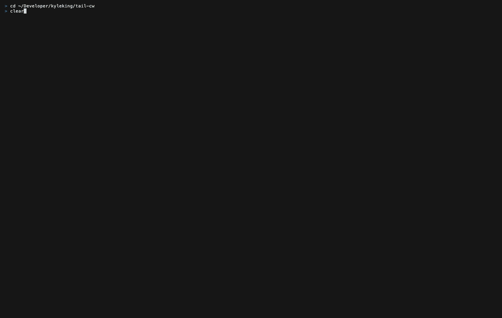

# tail-cw

Read and explore AWS CloudWatch from the terminal: tail logs live, open a dashboard you already built in the console, reshape a metric chart with the keyboard, and drop from any chart into the logs behind it.

The CloudWatch console answers "how is the service doing right now", but it pulls you out of the terminal, and every dedicated CloudWatch tailer (awslogs, saw, cw, utern) went dormant between 2019 and 2023 and predates the Live Tail API. tail-cw stays where the work happens. It wraps `StartLiveTail` for real streaming, caches every fetch as local Parquet so re-filtering costs nothing, and renders your console dashboards as native terminal charts (Unicode, no graphics protocol, so they work over SSH). If what you want is a full web GUI, Grafana's CloudWatch data source is the honest answer. tail-cw aims to be the best terminal tool for a narrow set of daily tasks.

Run `tail-cw` with no arguments and you land in the log group browser. Everything else is a keystroke away in the same app: `:` switches views, `Esc` goes up, `Ctrl+O` and `Ctrl+I` walk a jumplist so diving into logs and coming back costs nothing. One Textual-free core (`tail_cw/cli.py`) owns argument parsing, the cache, and the AWS pipelines; the TUI and `tail-cw export` sit on top of the same functions, so agents and humans drive one code path. See the [ADRs](docs/docs/adr) for the decisions, [plans/roadmap-2026-07.md](plans/roadmap-2026-07.md) for what is built and what is next, and [AGENTS.md](AGENTS.md) for where to start.

## What it does

- A log group browser as the home screen, with a preview pane that shows each group's distinct message shapes and their counts, so you can tell forty `/aws/lambda/*` groups apart by content rather than by name. Groups you have opened before sort to the top, per account
- Named presets in config, so `tail-cw tail @api` opens the set of groups you always look at together
- Live tail through `StartLiveTail` (up to 10 groups) with a ring buffer, pause and resume, and bounded reconnect. `L` flips a historical search to live and back without losing the filter or window
- One filter model that reads the same across the live stream, a historical fetch, and cached data
- Every fetch cached as ZSTD Parquet and queried locally with DuckDB or Polars, so re-filtering and trace grouping are free after the first pull
- Dashboard import by name via `GetDashboard`, or from a local JSON file in the same schema, rendering metric widgets as charts, log widgets as Logs Insights queries, and text widgets as markdown
- Metric charts drawn natively with plotext (braille curves plus real text axes and legend), so nothing depends on a graphics protocol and there are no rendering artifacts
- A no-scroll overview grid of color-coded sparklines (errors red, latency amber, traffic blue, saturation purple, availability green) with a focus stage; a multi-series metric compacts to a min-max band with a median line
- Keyboard-first exploration: `hjkl` to move, Enter to focus a chart, a `:` command line (Tab completion over view names, group names, and dashboard names, plus history) and `?` for a which-key reference
- Dive from a chart into the logs behind it. tail-cw ranks candidate log groups from the widget's dimensions and from which groups actually had events in that window, then shows you the list with counts before it queries anything
- `tail-cw export` writes NDJSON or JSON to stdout for agents and pipes, over the same functions the TUI uses

## Demo

`tail-cw dash --demo` renders a synthetic service dashboard from seed data (a mid-window incident: a latency and error spike with a traffic dip), so it needs no AWS account. The clip shows the overview grid, focusing a chart on the stage, `:panels` and `:range` on the command line, the which-key reference, and diving into the logs behind the errors panel.



Charts are Unicode, so they render the same in any terminal and over SSH. Regenerate the clip with `mise run gif`.

## Why this exists

Dedicated CloudWatch tailers solved log streaming years ago and then stopped. The gap now is everything around the logs: live streaming through the current API, dashboards and metrics without the console, and a fast path from a chart to the logs that explain it.

- Grafana or the CloudWatch console: richer and mouse-driven, and out of the terminal. Reach for them when you want a web GUI
- awslogs, saw, cw, utern: the dedicated tailers, all dormant and predating Live Tail and the newer Insights query languages
- `aws logs tail` / `start-live-tail`: native, but a bare pane with no structure, no caching, and no dashboards
- Gonzo: a strong log-analysis TUI with no native CloudWatch source, so you pipe `aws logs tail` into it
- AWS CloudWatch MCP server: Insights and pattern analysis for agents, with no live tail and no human surface

## Install

```sh
git clone https://github.com/kyleking/tail-cw && cd tail-cw
uv sync
```

`uv sync` installs the chart stack (textual-plotext) alongside the core.

## Usage

```sh
uv run tail-cw                                    # browse log groups (the home screen)
uv run tail-cw dash --demo                        # offline synthetic dashboard, no AWS
uv run tail-cw dash my-service --region us-east-1 # open a console dashboard
uv run tail-cw logs '/aws/lambda/api*' --start 2h # open the log view on matching groups
uv run tail-cw tail /aws/lambda/my-fn             # open it streaming live
uv run tail-cw tail @api                          # open a named preset from config
```

`logs`, `tail`, and `dash` only choose the opening view; every one of them lands in the same app, so anything reachable from one is reachable from the others.

A group pattern resolves down a ladder, stopping at the first rung that matches: anything containing `*`, `?`, or `[` is treated as a glob, and otherwise an exact name wins alone, then a prefix, then a substring, then a case-insensitive substring. So `handler` finds `/aws/lambda/api-handler` without the leading path, which is what you want when the memorable part of a CloudWatch name sits in the middle.

For stdout instead of a terminal app, use `export`:

```sh
uv run tail-cw export logs /aws/lambda/my-fn --start 2h  # NDJSON events
uv run tail-cw export tail /aws/lambda/my-fn             # NDJSON, flushed per line
uv run tail-cw export groups '/aws/lambda/*'             # NDJSON group metadata
uv run tail-cw export dashboards                         # NDJSON dashboard list
uv run tail-cw export dashboard my-service               # the parsed dashboard as JSON
```

### Keys

Everywhere: `:` command line, `Esc` up one level, `Ctrl+O` / `Ctrl+I` back and forward through the jumplist, `[` / `]` previous and next sibling (dashboards in a dashboard, groups in a log view), `?` which-key, `q` quit.

In the browser: `/` filters, `Space` multi-selects up to ten groups, `Enter` opens the logs, `t` opens them streaming.

In a log view: `/` searches, `Enter` opens the record detail, `L` toggles live, `r` refreshes, `t` and `T` open the trace views.

In a dashboard: `hjkl` move, `Enter` focuses a chart on the stage, `Esc` clears the stage and then goes up, `s` cycles the statistic, `p` the period, `d` dives into the logs.

Commands include `:groups`, `:logs`, `:tail`, `:dash <name>`, `:dashboards`, `:range 6h`, `:filter ERROR`, `:panels errors`, `:focus latency`, `:stat`, `:period`, and `:help`. In a dashboard, `:add <title>` puts a second panel beside the staged one, `:dive` opens the logs behind the focused widget, and `:reset` clears the stage. Set `AWS_PROFILE`, `--profile`, or `--region` to pick an account.

## Requirements

- Python 3.11 or newer
- AWS credentials through the standard chain (environment, profile, SSO, or role); `--profile`, `--region`, or `AWS_PROFILE` select them, and the profile is part of the cache key so accounts never collide
- Any terminal; charts are Unicode and need no graphics protocol

## Development

```sh
uv sync
uv run ruff format && uv run ruff check --fix --unsafe-fixes
uv run mypy && uv run pyright
uv run pytest -q
```

See [AGENTS.md](AGENTS.md) for the testable-first conventions this project follows.

## License

[MIT](LICENSE)
