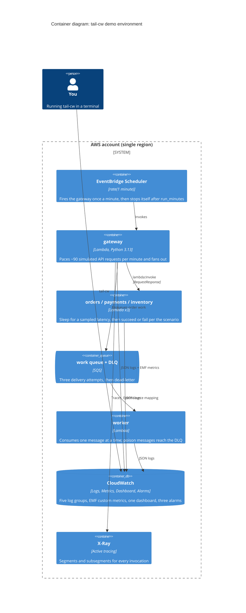

# demo-aws

A throwaway AWS environment that generates the kind of data tail-cw is built to read: structured JSON logs across five services, a trace id that ties one request together across all of them, real metrics, a dashboard, and alarms that actually fire. It runs for fifteen minutes, stops generating traffic on its own, and costs a few cents at most.

This is the counterpart to `tail-cw dash --demo`. That one is offline seed data. This one is real CloudWatch.

## What it stands up



Five Lambda functions share one deployment package; `SERVICE_NAME` selects the behaviour. Nothing runs in a VPC, so there is no NAT gateway and no subnet to wait on.

## First-day setup

You need an AWS account and credentials on the standard chain. Everything else installs itself.

```sh
cd demo-aws
mise install          # pins OpenTofu 1.12
tofu init
tofu apply
```

State is a local `terraform.tfstate` file, so there is no backend to configure and no account to sign up for. The Lambda zip is built by the `archive_file` data source straight from `src/`, so there is no build step, no Docker, and no packaging tool.

Your own credentials need `logs:DescribeLogGroups`, `logs:FilterLogEvents`, `logs:StartLiveTail`, `cloudwatch:ListDashboards`, `cloudwatch:GetDashboard`, and `cloudwatch:GetMetricData` to drive tail-cw against it.

## Watching it

`tofu apply` prints the dashboard name, the log groups, and the time traffic stops. Add the preset it prints to `~/.config/tail-cw/config.toml`, then:

```sh
tail-cw dash tail-cw-demo --region us-east-1   # the dashboard, as terminal charts
tail-cw tail @demo                             # all five groups streaming live
tail-cw logs @demo --filter '{ $.level = "ERROR" }' --start 15m
```

From a chart, `d` dives into the log groups behind it. That works because every Lambda widget carries a `FunctionName` dimension, which tail-cw maps to `/aws/lambda/<name>`. In a log view, `t` groups by `trace_id`, which is why all five groups belong in one selection: a trace spans every service that touched the request.

## The scenario

The handler reads `RUN_EPOCH` (stamped at apply time) and decides which phase it is in, so the fifteen minutes have a shape rather than being uniform noise.

| Minutes | Phase | What you see |
| --- | --- | --- |
| 0 to 2 | warmup | Cold starts, latency about 1.4x baseline, errors near 1% |
| 2 to 6 | steady | Baseline. Errors near 1.5% |
| 6 to 10 | incident | `payments` degrades: 35% failures, latency 7x. The gateway returns 502 on checkout, the queue backs up, poison messages reach the DLQ, and all three alarms go off |
| 10 to 12 | recovery | `payments` improves to 10% failures at 2.5x latency |
| 12 on | steady | Back to baseline |

Failures split two ways on purpose. About 70% return a 5xx to the caller, and the rest raise, so `AWS/Lambda Errors` is non-zero and the error-rate alarm has something real to measure.

## Log fields

These field names are a contract with tail-cw's parsers. `scenario.build_log_record` owns them and `tests/test_scenario.py` asserts tail-cw's own `extract_trace_id_from_event`, `extract_span_metadata`, `extract_service_name`, and `is_error_event` read them correctly, so drift on either side fails the test suite.

| Field | Why it is there |
| --- | --- |
| `level` | Error detection reads `ERROR`, `FATAL`, and `CRITICAL` |
| `service_name` | Groups spans by service in the trace view |
| `trace_id` | One simulated request across every service that handled it |
| `span_id` | One service's leg of that request |
| `duration_ms` | One of the four duration names tail-cw recognises. `latency_ms` is not among them |
| `status_code` | Anything at 500 or above counts as an error |
| `event`, `route`, `phase`, `error_type` | Give the group browser several distinct message shapes to cluster |
| `xray_trace_id` | Pivot from a log line into the X-Ray console |

`parent_span_id` is deliberately absent, matching [ADR 0012](../docs/docs/adr/0012-export-traces-instead-of-drawing-them.md): these logs carry no parent links, so emitting one would imply a hierarchy that is not there.

The request-completion line doubles as an Embedded Metric Format record. The same line a human reads in the log view produces `RequestCount`, `RequestLatencyMs`, `OrdersPlaced`, `OrderValueUsd`, and `PaymentDeclines`. Only `service_name` is a dimension, which holds the custom-metric count at five and inside the free tier.

## Cost

A fifteen-minute run at the default 90 requests per minute works out to roughly 1,350 simulated requests, about 2,500 Lambda invocations against a million-per-month allowance, around 210 GB-seconds against 400,000, some 5,000 log lines and 2 MB of ingestion against 5 GB, and 15 X-Ray traces (one per gateway invocation) against 100,000. The parts that are not always-free are five custom metrics and three alarms, and ten of each are free. Log retention is one day, so a forgotten teardown does not accrue storage.

## Stopping and restarting

Traffic stops on its own. `time_static.run` is stamped at apply time and the schedule's `end_date` is `run_minutes` past it, so nothing keeps firing if you walk away.

```sh
tofu apply -replace=time_static.run   # start a fresh run and reset the incident clock
tofu apply -var schedule_enabled=false  # keep the stack, stop the traffic
tofu destroy                          # remove everything
```

`mise run up`, `mise run restart`, and `mise run down` wrap those.

Because `end_date` is derived from that timestamp, re-applying an expired stack without `-replace` leaves the schedule finished. That is the intended default: an idle stack generates nothing.

## Known limits

X-Ray scopes a trace root to one Lambda invocation, and the gateway serves a whole minute of simulated requests inside a single invocation. So one X-Ray trace covers a minute of traffic rather than one request, and `trace_id` in the logs is minted per request instead. Both ids are on every line. Putting an HTTP API in front of the gateway and driving it from a separate load generator would make the two ids identical, at the cost of five more resources and a second Lambda. That seemed like the wrong trade for a demo whose consumer, tail-cw, reads logs rather than X-Ray.

The `Saturation: concurrent executions` widget uses the account-wide `AWS/Lambda ConcurrentExecutions` metric, because per-function concurrency is only published when reserved concurrency is set. In a busy account that number reflects more than this demo.
