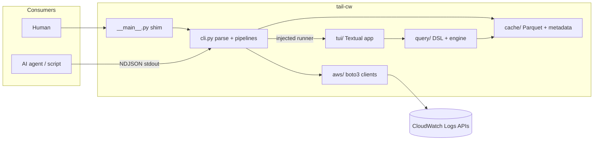

# ADR 0002: CLI-first layered architecture with an injected TUI runner

Date: 2026-07-05 Status: Accepted

## Problem

The tool must serve three consumers with one codebase: a human in a TUI, a human or script on the command line, and AI agents that need structured output. The original entry point constructed the Textual app directly, which would have coupled every feature to the TUI and made agent consumption an afterthought.

## Options considered

1. TUI-first: features live in the Textual app, CLI flags configure it. Fastest to demo, but logic gets trapped in widgets, agents get nothing, and Pilot tests become the only test surface
1. Separate binaries or an MCP server as the agent surface: duplicates dispatch and drifts from the human tool. The official AWS MCP server already exists for the Insights-for-agents niche
1. CLI-first with dependency-injected TUI: all orchestration in a Textual-free `cli.py`, `__main__.py` injects the TUI runner, `--json` bypasses the TUI entirely

## Decision

Option 3. `tail_cw/cli.py` owns argument parsing, time parsing, and the pipelines, and intentionally does not import Textual. `__main__.py` is a thin shim that passes runner callables (`run_tui`, `run_tail_tui`) into `run_cli`. Argparse (stdlib) over Typer/click keeps the dependency count down per AGENTS.md.

C2 container view: the CLI layer is the single dispatch point, the TUI is one of two output surfaces, and the query engine and cache are shared by both.

| Layer         | Module        | Responsibility                                                           |
| ------------- | ------------- | ------------------------------------------------------------------------ |
| Entry         | `__main__.py` | Inject TUI runners, top-level error mapping to exit codes                |
| Orchestration | `cli.py`      | argparse subcommands, time parsing, fetch/tail pipelines, NDJSON writers |
| Output        | `tui/`        | Textual app, ring buffer rendering, modals                               |
| Query         | `query/`      | Filter DSL parser, DuckDB/Polars engine, trace heuristics                |
| Storage       | `cache/`      | Cache keys, Parquet write/read, TTL and size eviction                    |
| Edge          | `aws/`        | boto3 clients, FilterLogEvents pagination, StartLiveTail streaming       |

Supporting decisions made alongside:

- fakes are injected as plain callables (`fetch_events`, `stream_events`, runner callables), not mocks of boto3, so pipeline tests run with no network and no patching
- request parameters are frozen dataclasses (`FetchRequest`, `TailRequest`) so the TUI can re-derive work (refresh re-fetches with `dataclasses.replace(end_time=now)`)
- bare `tail-cw` prints help and exits 2 rather than opening an empty TUI
- AWS profile support goes through `boto3.Session(profile_name=...)` and the profile participates in the cache key, since the two day-to-day profiles may map to different accounts

## Tradeoffs

- Two runner callables (fetch vs tail) is mild duplication; a third subcommand may motivate a small runner protocol
- argparse is more verbose than Typer but adds zero dependencies and keeps help output predictable for agents
- Keeping Textual imports out of `cli.py` means `--json` paths never pay TUI import cost, at the price of some indirection in `__main__.py`

## Consequences

- New features must be expressible as a pure pipeline function plus an optional TUI view, which keeps the agent surface complete by construction
- Exit codes are part of the contract: 0 success, 1 runtime/config error, 2 usage error
