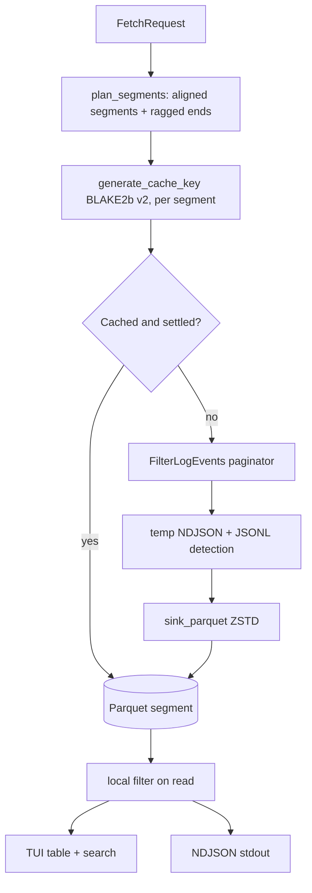

# ADR 0003: Local Parquet cache with a dual DuckDB/Polars query engine

Date: 2026-07-05 (records pre-existing design plus the M0 wiring decisions; the cache
key and the stored schema were revised on 2026-08-21 after production measurement)
Status: Accepted

## Problem

CloudWatch charges make exploratory querying expensive exactly when it is most needed
(incidents), and repeated fetches of the same window waste time and API throttling
budget.
The tool needs a local store that makes re-filtering, tabulating, and trace grouping
free after the first fetch.

## Cost model

Approximate us-east-1 pricing as of mid-2026.
Verify against [CloudWatch pricing](https://aws.amazon.com/cloudwatch/pricing/) before
relying on exact figures.

| Operation                         | Price                         | Implication                                                                          |
| --------------------------------- | ----------------------------- | ------------------------------------------------------------------------------------ |
| Logs Insights query               | ~$0.005 per GB scanned        | A single broad query over 50 GB costs ~$0.25, and incident spelunking multiplies it  |
| FilterLogEvents                   | No per-GB charge              | Free to scan, but slow and throttled (per-account TPS quotas)                        |
| Live Tail                         | ~$0.01 per minute per session | An hour of dev-loop tailing costs ~$0.60                                             |
| DescribeLogGroups                 | Free                          | Discovery metadata costs nothing                                                     |
| GetDashboard / GetMetricData      | ~$0.01 per 1,000 requests     | A full 28-widget dashboard refresh costs well under a tenth of a cent (see ADR 0005) |
| Local re-filter of cached Parquet | $0                            | The whole point                                                                      |

The strategy that falls out: prefer FilterLogEvents for bounded historical windows,
cache the results, and answer follow-up questions locally instead of re-querying AWS.
Reserve Insights (M3) for server-side aggregation that local data cannot answer, and
show scan estimates before running it.

## Options considered

1. In-memory only: simplest, but every session restart re-fetches, and large windows exceed
    memory
1. SQLite (lnav-style virtual tables): great ad-hoc SQL, but JSON columns and columnar
    scans over millions of rows are weaker, and we already depend on Polars
1. Parquet files keyed by request hash, with DiskCache for metadata: columnar, compressed
    (ZSTD), streamable via `scan_ndjson().sink_parquet()`, queryable by both DuckDB and
    Polars without loading into memory

## Decision

Option 3, which was already implemented and is now wired into the CLI pipeline (M0).



Key decisions inside this design:

- the cache key is a versioned BLAKE2b hash (`cache:v2:...`) over log group, segment
    bounds, sorted stream names, region, and profile, so different profiles/accounts never
    collide
- JSONL-looking messages are parsed at write time into a `parsed` struct column, making
    field filters (`{ $.level = "ERROR" }`, `level:ERROR`) cheap at query time
- eviction is TTL plus FIFO size limit with orphan cleanup, configured in `[cache]` in
    config.toml
- `--no-cache` bypasses the read but still writes, so a forced refresh still benefits the
    next query

### Segmented windows, and no filter in the key

Measured against Coverbase's prod account on 2026-08-21: a repeated fetch of a window
served from cache took 4.2s against 57.8s cold, a 13.8x win that nobody ever saw,
because the key held the caller's exact microsecond window and `now` moves between two
`--start 1h` runs.
Overlapping windows missed for the same reason: having cached 17:00-18:00 and
18:00-19:00, a request for 17:00-19:00 refetched both.

A request is now split into aligned segments plus the ragged ends, each cached under its
own key (`tail_cw/cache/window.py`).
The caller's window is never widened; only its interior is reusable.

```text
request:  17:15 ────────────────────────────────────► 18:15  (--start 1h at 18:15)
segments: [17:15-17:20)[17:20-17:25) … [18:05-18:10)  cached, immutable, reusable
tail:                                    [18:10-18:15)  refetched, expires in 15 minutes
```

Boundary spacing grows with the window (5 minutes up to an hour, an hour up to a day, a
day beyond) so the segment count stays bounded.
Two properties keep the result honest:

- a segment ending within `INGESTION_LAG` of now is **unsettled**: CloudWatch is still
    accepting events for it, so a hit on it is refetched rather than served.
    This is what stops a permanently short window from being cached forever under a `None`
    TTL
- a ragged end is keyed to one request and nothing else will ask for it, so it is written
    with a short TTL and reclaimed instead of accumulating

The filter is no longer part of the key, and a historical fetch no longer sends
`filterPattern`.
One cached window therefore serves every filter asked of it, evaluated locally by the
query engine.
The cost is bandwidth on a filtered cold fetch, which now downloads the whole window;
the gain is that the second question about that window is free no matter how it is
filtered, which is what a real investigation looks like.
Live tail keeps its server-side filter, because nothing caches it.

### What the v2 schema stores

Rewriting the largest cached file (26.9 MB, 375,598 events) measured where the disk
went:

| Variant                          |    Size | Share |
| -------------------------------- | ------: | ----: |
| v1 baseline                      | 26.9 MB |  100% |
| drop `event_id`                  | 21.3 MB |   79% |
| plus native datetime columns     | 21.2 MB |   79% |
| plus drop the redundant raw line | 10.1 MB |   38% |

`event_id` is gone from the schema and from `LogEvent`: its docstring claimed it existed
for deduplication, nothing deduplicated on it, and it cost 21% of the file.
No replacement key is needed: FilterLogEvents treats `endTime` as exclusive, so segments
are disjoint and composing them cannot duplicate an event.
For a JSON line the raw `message` and the `parsed` struct hold the same content, so the
raw line is stored only for events that did not parse, and `read_parquet_to_log_events`
rebuilds the text from `parsed` (compact JSON, with keys the line never carried
dropped).
Timestamps are stored as UTC datetimes rather than ISO strings, and rows are sorted by
timestamp, so row-group statistics can prune a time predicate.

One consequence reaches the query engine: a free-text filter can no longer match against
`message` alone, because it is null for every JSON event.
Both backends match against `coalesce(message, <parsed re-encoded as JSON>)`,
materialized per query rather than stored.

## Query engine: why two backends

The filter DSL parses to a `FilterNode` AST, then translates to either a DuckDB SQL
`WHERE` clause or a Polars expression.
`AUTO` selection routes regex and deep JSON-path filters to DuckDB and full scans and
simple predicates to Polars.
Benchmarks (`benchmark_backends`) showed neither backend dominates across filter shapes,
and both were already dependencies.
The cost of the dual dispatch tables is bounded because both consume the same AST.

## Tradeoffs

- Segmenting multiplies the API calls for one window (twelve for an hour).
    That is what makes the window fast rather than slow: `FilterLogEvents` paginates one
    page
    per round trip, so the segments run several at a time and a cold hour halves
    ([ADR 0011](0011-async-aws-io-and-blocking-work.md) carries the measurements and the
    ceiling)
- A JSON event's text does not round-trip byte for byte: whitespace, key order, and
    explicit nulls are lost.
    Everything that reads an event sees valid compact JSON, and no field value is lost
- A filtered cold fetch now downloads the whole window rather than the matching lines
- Live tail events are not yet flushed into the cache (see ADR 0004), so live scrollback
    is memory-only
- DuckDB SQL is built with manual string escaping for values (paths and limits are
    parameterized); the AST constrains inputs, but this is a known caveat if the DSL ever
    accepts raw user SQL
