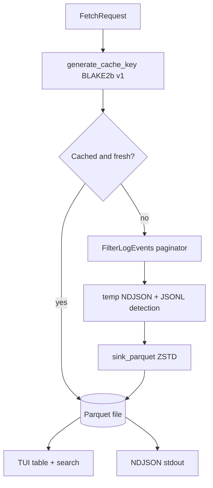

# ADR 0003: Local Parquet cache with a dual DuckDB/Polars query engine

Date: 2026-07-05 (records pre-existing design plus the M0 wiring decisions) Status: Accepted

## Problem

CloudWatch charges make exploratory querying expensive exactly when it is most needed (incidents), and repeated fetches of the same window waste time and API throttling budget. The tool needs a local store that makes re-filtering, tabulating, and trace grouping free after the first fetch.

## Cost model

Approximate us-east-1 pricing as of mid-2026. Verify against [CloudWatch pricing](https://aws.amazon.com/cloudwatch/pricing/) before relying on exact figures.

| Operation                         | Price                         | Implication                                                                         |
| --------------------------------- | ----------------------------- | ----------------------------------------------------------------------------------- |
| Logs Insights query               | ~$0.005 per GB scanned        | A single broad query over 50 GB costs ~$0.25, and incident spelunking multiplies it |
| FilterLogEvents                   | No per-GB charge              | Free to scan, but slow and throttled (per-account TPS quotas)                       |
| Live Tail                         | ~$0.01 per minute per session | An hour of dev-loop tailing costs ~$0.60                                            |
| DescribeLogGroups                 | Free                          | Discovery metadata costs nothing                                                    |
| GetDashboard / GetMetricData      | ~$0.01 per 1,000 requests     | A full 28-widget dashboard refresh costs well under a tenth of a cent (see ADR 0005) |
| Local re-filter of cached Parquet | $0                            | The whole point                                                                     |

The strategy that falls out: prefer FilterLogEvents for bounded historical windows, cache the results, and answer follow-up questions locally instead of re-querying AWS. Reserve Insights (M3) for server-side aggregation that local data cannot answer, and show scan estimates before running it.

## Options considered

1. In-memory only: simplest, but every session restart re-fetches, and large windows exceed memory
1. SQLite (lnav-style virtual tables): great ad-hoc SQL, but JSON columns and columnar scans over millions of rows are weaker, and we already depend on Polars
1. Parquet files keyed by request hash, with DiskCache for metadata: columnar, compressed (ZSTD), streamable via `scan_ndjson().sink_parquet()`, queryable by both DuckDB and Polars without loading into memory

## Decision

Option 3, which was already implemented and is now wired into the CLI pipeline (M0).

Key decisions inside this design:

- the cache key is a versioned BLAKE2b hash (`cache:v1:...`) over log group, time range, filter pattern, sorted stream names, region, and (since M0) profile, so different profiles/accounts never collide
- JSONL-looking messages are parsed at write time into a `parsed` struct column, making field filters (`{ $.level = "ERROR" }`, `level:ERROR`) cheap at query time
- eviction is TTL plus FIFO size limit with orphan cleanup, configured in `[cache]` in config.toml
- `--no-cache` bypasses the read but still writes, so a forced refresh still benefits the next query

## Query engine: why two backends

The filter DSL parses to a `FilterNode` AST, then translates to either a DuckDB SQL `WHERE` clause or a Polars expression. `AUTO` selection routes regex and deep JSON-path filters to DuckDB and full scans and simple predicates to Polars. Benchmarks (`benchmark_backends`) showed neither backend dominates across filter shapes, and both were already dependencies. The cost of the dual dispatch tables is bounded because both consume the same AST.

## Tradeoffs

- Each distinct time range creates a new cache entry, so refresh-with-extended-end writes a new file rather than appending (acceptable at current sizes, revisit if churn grows)
- Live tail events are not yet flushed into the cache (see ADR 0004), so live scrollback is memory-only
- DuckDB SQL is built with manual string escaping for values (paths and limits are parameterized); the AST constrains inputs, but this is a known caveat if the DSL ever accepts raw user SQL
