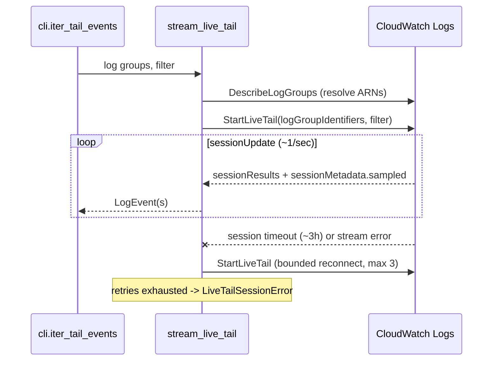

# ADR 0004: Live tail via StartLiveTail with a ring-buffered TUI

Date: 2026-07-05 Status: Accepted

## Problem

Dev-loop tailing (deploy, watch the service) is the most frequent daily task, and no maintained terminal tool wraps CloudWatch's real streaming API. The existing alternatives poll or scroll without structure. tail-cw needed live streaming that stays responsive under load, survives session limits, and presents the same filter model as historical fetches.

## Options considered

1. Poll FilterLogEvents on an interval (what `aws logs tail` and every legacy tool does): simple, no extra API, but seconds of added latency, duplicate/gap handling on every tick, and burns throttling quota
1. Shell out to `aws logs start-live-tail`: no boto3 work, but adds a runtime dependency on the AWS CLI, loses typed events, and complicates reconnects
1. Wrap `StartLiveTail` directly via botocore's event stream: true push streaming, up to 10 log groups, server-side filtering, at the cost of handling ARNs, session expiry, and a blocking stream read

## Decision

Option 3, implemented in `tail_cw/aws/live_tail.py` as a plain generator (`stream_live_tail`) with no Textual dependency.

API facts verified against the installed botocore service model (1.40.61):

- `logGroupIdentifiers` takes 1 to 10 log group ARNs and rejects the trailing `:*` that `DescribeLogGroups.arn` carries, so resolution prefers the newer unsuffixed `logGroupArn` field and falls back to `arn.removesuffix(':*')`
- updates arrive roughly once per second with up to 500 events; beyond 500 events/sec the server samples and sets `sessionMetadata.sampled`, which the TUI surfaces in the status line
- session timeout and streaming exceptions surface as `EventStreamError` (a `ClientError` subclass) during iteration, which is what the reconnect loop catches
- live events carry no `eventId`, so a deterministic id is synthesized from stream, timestamp, and message hash

## One filter model

The same `--filter` string is passed as `logEventFilterPattern` to Live Tail and as `filterPattern` to the FilterLogEvents backfill (`--backfill 15m` emits history first, then switches live). This is the logcli lesson: live and historical share one mental model, so "scroll back before I started tailing" is the same expression, not a different language.

## TUI rendering under load

The Textual guidance in AGENTS.md drives the render path:

- a worker thread consumes the generator and appends to a shared pending deque (thread-safe appends, no locks needed)
- a 0.25s interval drains the pending deque into a `deque(maxlen=live_buffer_limit)` ring buffer (default 10000, configurable) and renders one batch, never one row per event
- when the table would exceed the ring limit plus slack, it rebuilds from the buffer instead of growing unboundedly
- space pauses rendering while the buffer keeps filling, and resume rebuilds from the buffer, giving backpressure without data loss inside the window
- on stream failure after retries the app notifies and leaves the buffer browsable

## Cost estimate

Live Tail bills per minute of session time (~$0.01/min, so ~$0.60 per hour of tailing). This is the right trade for interactive dev loops but argues against leaving sessions running unattended, and is another reason the 3h server-side session cap plus bounded reconnects (rather than infinite retry) is acceptable.

## Tradeoffs and known limitations

- Live events are not flushed into the Parquet cache yet, so post-session analysis requires a `fetch` of the same window (candidate follow-up in M2/M3)
- A blocking botocore stream read cannot be interrupted, so on quit the worker may linger until the next chunk arrives (Textual cancels the worker and exits regardless)
- Reconnect also retries initial-call errors like AccessDenied up to the bound before raising, wasting at most 3 attempts
- Brief gaps or duplicates are possible across reconnect boundaries; the synthesized event id makes duplicates detectable downstream but they are not deduplicated today
