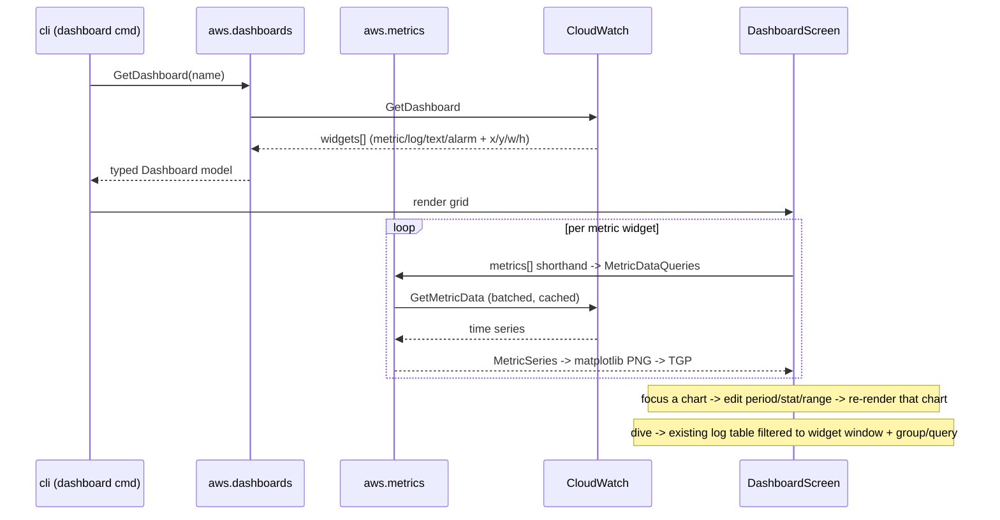

# ADR 0005: Dashboards, metrics, and terminal charts

Date: 2026-07-24 Status: Accepted (rendering superseded by ADR 0006)

The import, translation, and cost decisions below still hold. The rendering choice (matplotlib PNGs over the Kitty graphics protocol) did not survive contact with a real terminal and was replaced by native plotext rendering; see [ADR 0006](./0006-dashboard-rendering-and-interaction.md).

## Problem

tail-cw could tail and search logs but could not answer "how is the service doing right now" without leaving the terminal for the CloudWatch console. The need is threefold: read the dashboards already built in the console, reshape a metric chart with quick inputs the way Honeycomb or Sumologic let you, and jump from any chart into the logs behind it. The console does all three but pulls you out of the terminal, and every existing terminal tool does none of them.

## Options considered

Surface for the charts and exploration:

1. Extend the Textual TUI: reuse the M0 cache, the query engine, and the M3 trace-pivot pattern; stay terminal-native. Terminal charts cannot do smooth mouse brushing, so exploration becomes keyboard-driven parameter editing
1. A local web app with a JavaScript charting library: real mouse brushing and drag-zoom, but it discards the terminal thesis and most of the existing TUI, and adds a frontend stack
1. Adopt Grafana's CloudWatch data source: it already does dashboards, metric explore, and log panels

Chart rendering inside the TUI:

1. Braille or cell plotting (plotext, textual-plot, plotille): pure text, works over SSH, light, but no legends, dual axes, or anti-aliasing
1. Real image rendering: draw a matplotlib PNG and show it inline through a terminal graphics protocol (Kitty TGP or Sixel), with a text fallback

Dashboard source of truth:

1. `GetDashboard` only: mirror the console exactly, always in sync, but no saved local explorations
1. tail-cw-native config only: full control and offline, but you redeclare what the console already holds
1. Both, behind one typed model

## Decision

Extend the TUI (option 1). If the answer were a web app, Grafana is the honest choice, so a web pivot would only build a worse Grafana. The goal is the best terminal tool for a narrow set of daily tasks, so exploration is keyboard-first with vim-style range motions and no mouse dependency.

Charts render as matplotlib PNGs shown inline through the Kitty graphics protocol via `textual-image`, with a braille fallback for terminals without image support. matplotlib is heavy (about 30 MB) but battle-tested and actively maintained, unlike plotext, which has had no meaningful release since late 2023. numpy is already a dependency. Rendering is a pure function of the series and style inputs, so PNGs cache by input hash and only the focused chart re-renders on a keypress, which keeps the roughly 100 ms per-chart cost off the critical path.

Dashboards come from both sources behind one typed widget model (option 3), so a console import and a saved tail-cw exploration share the same render path.

API facts verified against account 760682031284 (us-east-1) on 2026-07-24:

- `GetDashboard` on `irm-prod-main` returned 43 widgets (28 metric, 8 text, 6 log, 1 alarm). Metric widgets carry the console `metrics[]` shorthand: raw rows shaped `[Namespace, MetricName, DimName, DimVal, ..., {options}]`, positional `.` ditto references to the previous row, and metric-math `expression` rows. Log widgets carry a Logs Insights `query` string with a `SOURCE '...'` clause. Text widgets carry markdown
- `GetMetricData` with a metric-math availability expression (`IF(m_total > 0, (1 - FILL(m_5xx,0)/m_total)*100, 100)`) returned 36 datapoints in about 0.7s. It batches up to 500 metrics per request and supports metric math, so one call serves a whole panel
- the main build risk is the shorthand-to-`MetricDataQueries` translation, which is fiddly (positional ditto resolution against the previous row) but well defined

## Cost model

`GetMetricData` and `GetDashboard` bill at $0.01 per 1,000 requests (verified against [CloudWatch pricing](https://aws.amazon.com/cloudwatch/pricing/) on 2026-07-24), so a full 28-widget dashboard refresh costs well under a tenth of a cent. Earlier notes that metric fetches "cost money per call and need the same disk-cache treatment as log fetches" overstated it. Metric results still cache, for latency and request-quota headroom, not to save money. The one paid path to watch is Logs Insights behind log widgets at about $0.005 per GB scanned, so a log widget shows a scan estimate before it runs, matching the M3 rule.

## Tradeoffs and consequences

- matplotlib and textual-image land in a new `charts` dependency group, kept out of the `--json` and headless paths so agents never pay the import cost
- image-protocol rendering depends on terminal support; the braille fallback keeps the tool usable over plain SSH, at lower fidelity
- the shorthand translator will not cover every exotic console option on day one (per-metric `region`, `accountId`, anomaly-detection bands); unsupported rows render as a labeled gap rather than failing the whole panel
- dive-to-logs and the log-volume histogram reuse the existing log table and query engine, so the new interaction is a `Screen` plus a filter hand-off, not a new paradigm
- follows ADR 0002: the fetch and translate steps are pure pipeline functions with `--json` output, and the TUI is one view over them
